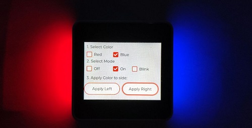

# M5Stack Core2 - LVGL + FastLED example 



The M5Stack Core2 - LVGL + FastLED example is a project that showcases the capabilities of the M5Stack Core2 development board, the LVGL graphics library and FastLED. 

# Quickstart
 - Clone repository
```
git clone https://github.com/alptbz/core2guidemo
```
 - Open repository with PlatformIO
 - rename `src/config.cpp.template` to `src/config.cpp`
 - Adjust serial port in `platform.ini`
 - Build and upload

# Links
 - ToF Sensor Library: https://registry.platformio.org/libraries/pololu/VL53L0X/installation
 - Tof Sensor Example: https://github.com/pololu/vl53l0x-arduino/blob/master/examples/Continuous/Continuous.ino
 - Used LVGL Example: https://github.com/mhaberler/m5core2-lvgl-demo
 - LVGL 7.x Docs: https://docs.lvgl.io/7.11/
 - Original chinese source: https://macsbug.wordpress.com/2021/06/18/how-to-run-lvgl-on-m5stack-esp32/
 - FastLED Example: https://github.com/m5stack/M5-ProductExampleCodes/blob/master/Base/M5GO_BOTTOM2/M5GO_BOTTOM2.ino

# More examples
 - https://github.com/alptbz/core2guitofexample/
 - https://github.com/alptbz/core2numpad/