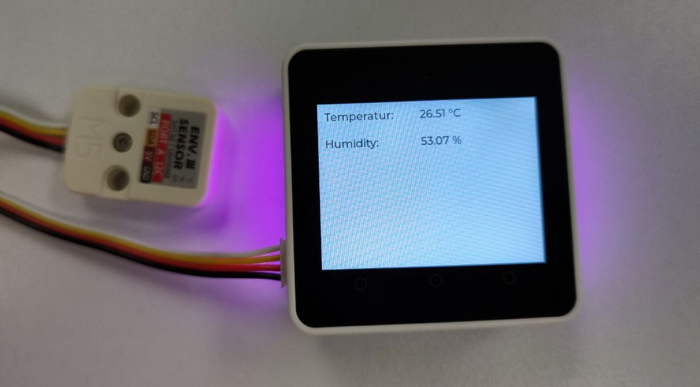

# M5Stack Core2 - LVGL + MQTT + ENVIII Sensor example



The M5Stack Core2 - LVGL + MQTT + ENVIII Sensor example is a project that showcases the capabilities of the M5Stack Core2 development board, the LVGL graphics library and the [ENVIII sensor](https://shop.m5stack.com/products/env-iii-unit-with-temperature-humidity-air-pressure-sensor-sht30-qmp6988). 

# Quickstart
 - Clone repository
```
git clone https://github.com/alptbz/core2env3demo
```
 - Open repository with PlatformIO
 - rename `src/config.cpp.template` to `src/config.cpp`
 - Adjust serial port in `platform.ini`
 - Build and upload

# Links
 - Used LVGL Example: https://github.com/mhaberler/m5core2-lvgl-demo
 - LVGL 7.x Docs: https://docs.lvgl.io/7.11/
 - Original chinese source: https://macsbug.wordpress.com/2021/06/18/how-to-run-lvgl-on-m5stack-esp32/
 - FastLED Example: https://github.com/m5stack/M5-ProductExampleCodes/blob/master/Base/M5GO_BOTTOM2/M5GO_BOTTOM2.ino
 - Image convert: https://lvgl.io/tools/imageconverter

# More examples
 - https://github.com/alptbz/core2guitofexample/
 - https://github.com/alptbz/core2numpad/


## License
<a rel="license" href="http://creativecommons.org/licenses/by-nc-sa/4.0/"></a><br />This work is licensed under a <a rel="license" href="http://creativecommons.org/licenses/by-nc-sa/4.0/">Creative Commons Attribution-NonCommercial-ShareAlike 4.0 International License</a> and [GNU GENERAL PUBLIC LICENSE version 3](https://www.gnu.org/licenses/gpl-3.0.en.html). If there are any contradictions between the two licenses, the Attribution-NonCommercial-ShareAlike 4.0 International license governs. 
